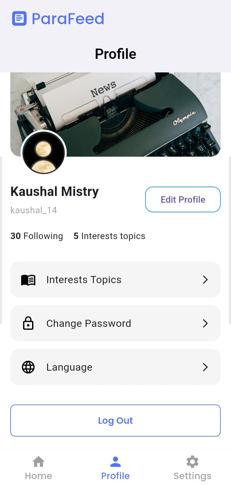
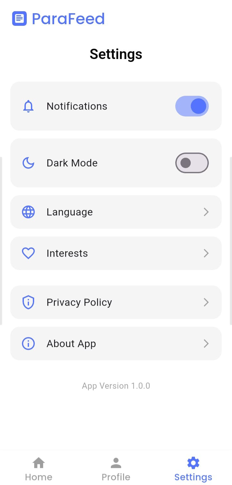

# ParaFeed 📰👁️

ParaFeed is a news application focused on paranormal, unexplained, and suspicious activities from around the world.  
It delivers category-wise news, real-time updates, and a clean reading experience through API-powered content.

This project was built to practice real-world mobile app development concepts, especially **API integration and data-driven UI**.

---

## 📱 Screenshots

### Home Screens

  
  
  

### Authentication

  
  

### Profile & Settings

  
  

---

## ✨ Features
- Category-wise paranormal news
- Real-time news fetching using APIs
- Pull-to-refresh for latest updates
- User authentication (Login & Signup)
- Full news detail view on tap
- User profile page
- Settings page
- Clean and distraction-free reading UI

---

## 🛠 Tech Stack
- Framework: Flutter
- Language: Dart
- Architecture: MVVM
- API Handling: REST APIs
- State Management: Provider / setState
- Networking: HTTP package
- Tools: Android Studio, Git, GitHub

---

## 🔐 Authentication Flow
- Users can create an account using the **Sign Up** screen
- Existing users can log in using the **Login** screen
- Authentication state is maintained across app sessions
- Logged-in users can access profile and settings pages

---

## 🌐 API Integration
ParaFeed fetches paranormal and suspicious activity news using REST APIs and displays content dynamically based on selected categories.

Key implementation details:
- API calls handled using the HTTP package
- JSON responses mapped to strongly typed model classes
- Proper handling of loading, empty, and error states
- Pull-to-refresh implemented to fetch the latest news
- Category-based API filtering for organized content

---

## 🧠 App Architecture
The application follows a clean and scalable architecture:

- MVVM-based structure for separation of concerns
- Dedicated layers for UI, data models, and API services
- Reusable widgets for consistent UI
- Centralized state management for better maintainability

This approach makes the app easier to scale and debug.

---

## 📚 What I Learned
- Working with real-world REST APIs
- Handling asynchronous data and UI updates
- Designing category-based dynamic content
- Managing authentication and user sessions
- Implementing pull-to-refresh functionality
- Structuring Flutter projects for scalability
- Writing clean, readable, and maintainable code

---

## 🔮 Future Improvements
- Bookmark or save articles for later reading
- Push notifications for breaking paranormal news
- Advanced search and filtering
- Offline reading mode
- API response caching for better performance
- Enhanced dark mode experience

---

## 👨‍💻 Author
**Kaushal Mistry**  
Flutter / Android Developer  
GitHub: https://github.com/kaushalmistry5